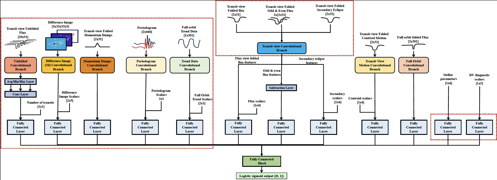

# ExoMiner

[//]: # (![ExoMiner Logo.]&#40;/others/images/exominer_logo.png&#41;)

    

#### Written by [Miguel Martinho](https://migmartinho.github.io) (miguel.martinho@nasa.gov)

## Introduction

This project's mission is to develop, test, and deploy automated machine learning-based methods to sift ('mine') through 
transit photometry data from exoplanet survey missions such as Kepler and TESS and inform subject matter experts (SMEs) 
on potential transiting planet candidates.

### Current main goals

The main goals of the `ExoMiner` project are:

1. Perform classification of transit signals in Kepler and TESS data;
2. Create vetted catalogs of Threshold Crossing Events (TCEs) for Kepler and TESS runs for the exoplanet community.
3. Validate new exoplanets using Kepler and TESS data.

## ExoMiner Pipeline [**NEW**]

The [ExoMiner Pipeline](/exominer_pipeline) is a fully integrated pipeline from TIC IDs to ExoMiner prediction scores 
for the corresponding 
TESS SPOC TCEs in 2-min/FFI data. This pipeline makes use of Podman as a container framework to provide a seamless 
experience to the user - no need for setting up the code repository and install package dependencies! Simply get the 
Podman image for your system's architecture using the [manifest](/docs/getting-started.md#pulling-the-image). See the 
documentation in [here](/docs/index.md) to get started.

For those interested in running the pipeline without resorting to Podman, see 
[Running the pipeline without Podman](/docs/running-exominer-pipeline.md#running-the-pipeline-without-podman).

## Repository Overview

The repository consists of the following main blocks:

1. Data preprocessing: preprocess data products (e.g. light curve FITS files) to generate a catalog of transit signal 
features to be used for training and evaluating models, and to run inference on it. Code under
[src_preprocessing](/src_preprocessing).
2. Model training/evaluation/prediction: train and evaluate models on the preprocessed data. Run inference on the data 
using trained models. Code under [src](/src).
3. Model evaluation using cross-validation under [src_cv](/src_cv).
4. Hyperparameter Optimization: use code under [src_hpo](src_hpo) to run hyperparameter optimization experiments to 
find an optimized architecture for a given task.
5. Model Development: use code under [models](models) to access and modify ExoMiner architectures. 

## Source Data

All data used in this project are publicly available. Generally, the data used consist of:

- TCE and Objects of Interest (e.g. KOI and TOI catalogs) tables available in archives/respositories such as
  [NExSci](https://exoplanetarchive.ipac.caltech.edu/),
  [ExoFOP](https://exofop.ipac.caltech.edu/), [TEV](https://tev.mit.edu/data/) and
  [MAST](https://archive.stsci.edu/);
- Light curve and target pixel FITS files created by the Kepler/TESS Missions, and data products generated by the Kepler/TESS Science Processing Operations Center (SPOC) available in archives such as the [MAST](https://archive.stsci.edu/).

## Models

Models currently implemented in [models](models/models_keras.py):

1. `ExoMiner++` [**CURRENT**]: Improved architecture for TESS. Used in TESS paper (see [References](#references)).

[//]: # (2. Astronet: see https://github.com/google-research/exoplanet-ml and Shallue, Christopher J., and Andrew Vanderburg. ")

[//]: # (   Identifying exoplanets with deep learning: A five-planet resonant chain around kepler-80 and an eighth planet around)

[//]: # (   kepler-90." The Astronomical Journal 155.2 &#40;2018&#41;: 94.)

[//]: # (3. Exonet: see Ansdell, Megan, et al. "Scientific domain knowledge improves exoplanet transit classification with deep)

[//]: # (   learning." The Astrophysical journal letters 869.1 &#40;2018&#41;: L7.)

[//]: # (4. Exonet-XS: see Ansdell, Megan, et al. "Scientific domain knowledge improves exoplanet transit classification with)

[//]: # (   deep learning." The Astrophysical journal letters 869.1 &#40;2018&#41;: L7. 5 MLP: Multi-layer Perceptron.)

## References

For more detailed information see the following publications:
- ExoMiner for Kepler ["ExoMiner: A Highly Accurate and Explainable Deep Learning Classifier that Validates 301 New Exoplanets"](https://iopscience.iop.org/article/10.3847/1538-4357/ac4399/meta), published 2022 February 17 in the Astrophysical Journal, Volume 926, Number 2.
- ExoMiner with Multiplicity Boost for Kepler ["Multiplicity Boost of Transit Signal Classifiers: Validation of 69 New Exoplanets using the Multiplicity Boost of ExoMiner"](https://iopscience.iop.org/article/10.3847/1538-3881/acd344/), published 2023 June 26 in the Astronomical Journal, Volume 166, Number 1.
- ExoMiner for TESS 2-min ["ExoMiner++: Enhanced Transit Classification and a New Vetting Catalog for 2-Minute TESS Data"](https://iopscience.iop.org/article/10.3847/1538-3881/ae03a4), published 2025 October 27 in the Astronomical Journal, Volume 170, Number 5
  - **Data repository on Zenodo**: [here](https://doi.org/10.5281/zenodo.15466292)
  - **Interactive vetting catalog**: [here](http://exominer-vetter-tess-pc-catalog.onrender.com/)

## Credits

This work was developed by members of the Data Sciences Group, DASH, Intelligent Systems Division (Code-TI) at NASA Ames 
Research Center (NASA ARC).

- Main Contributors
  - Hamed Valizadegan1,2 (PI), hamed.valizadegan@nasa.gov
  - Miguel Martinho1,2 (Co-I), miguel.martinho@nasa.gov

- Collaborators
  - Active Collaborators
      - Doug Caldwell1,3
      - Jon Jenkins1,3
      - Joseph Twicken1,3
    
  - Past Collaborators
    - Stephen Bryson1
    - Jeff Smith1,3
  
- Developers
  - Active Developers
    
  - Past Developers 
      - Andrés Carranza 2,5 (Unfolded phase time series for transit signal classification)
      - Fellipe Marcellino2 (Transit detection using Kepler data)
      - Jennifer Andersson4 (Kepler to TESS transfer learning)
      - Kaylie Hausknecht2,6 (Explainability framework using Kepler data)
      - Laurent Wilkens2 (Kepler)
      - Martin Koeling4 (Kepler to TESS transfer learning)
      - Nikash Walia2 (Kepler)
      - Noa Lubin 4 (Kepler)
      - Pedro Gerum4 (Kepler, Kepler non-TCE classification)
      - Patrick Maynard2,5,7 (Kepler to TESS transfer learning)
      - Sam Donald4 (Kepler to TESS transfer learning)
      - Theng Yang2,7 (Label noise detection in Kepler data)
      - Hongbo Wei2,6,7 (Kepler non-TCE classification, KOI classification, Kepler to TESS transfer learning)
      - Stuti Agarwal 6 (Difference image)
      - Joshua Belofsky 2,5 (Difference image)
      - Charles Yates 2,5 (Unfolded phase time series for transit signal classification, Kepler to TESS 
      transfer learning)
      - William Zhong 5 (Difference Image)
      - Ashley Raigosa7 (TESS SPOC FFI)
      - Saiswaroop Thammineni7 (Transit Encoding)
      - Kunal Malhotra7 (Transit Detection)
      - Eric Liang7 (Transit Encoding)
      - Ujjawal Prasad8 (Transit Detection)
      - Adithya Giri7 (Brown Dwarfs vs Planets Classification; Structured and Adversarial Training for Transit 
       Classification Robustness)
      - Josue Ochoa7 (Transit Detection)
      - Aniket Mittal7 (XAI for ExoMiner)

1 - NASA Ames Research Center (NASA ARC)\
2 - KBR Inc.\
3 - The SETI Institute\
4 - NASA International Internship Program (NASA I2)\
5 - NASA Internships, Fellowships & Scholarships (NIFS)\
6 - Volunteer Internship Program (VIP)\
7 - NASA Office of STEM Engagement (OSTEM)\
8 - NASA-Chabot High School Learning Experience (NASA-CHSLE)

## Acknowledgements

We would like to acknowledge people that in some way supported our efforts:

- A big thank you to all the interns who dedicated their time to supporting the development of ExoMiner!
- The SPOC team (Jon Jenkins, Joe Twicken, Doug Caldwell) at NASA Ames/SETI for their insight, knowledge, and support!
- David Armstrong for an insightful discussion that improved our work.
- Megan Ansdell for providing information on their code and work on Exonet.
- The main contributors (HV and MM) are supported through TESS XRP 2022 contract 22-XRP22 2-0173, NASA Academic Services 
Mission (NAMS) contract number NNA16BD14C as well as the Intelligent Systems Research and Development 3 (ISRDS-3) 
Contract 80ARC020D0010.
- Resources supporting this work were provided by the NASA High-End Computing (HEC) Program through the NASA Advanced 
Supercomputing (NAS) Division at Ames Research Center.
- This work has made use of data products created by the Kepler/TESS Science Processing Operations Center (SPOC) 
pipeline at NASA Ames Research Center.
- This work has made use of data from the European Space Agency (ESA) mission Gaia (https://www.cosmos.esa.int/gaia), 
processed by the Gaia Data Processing and Analysis Consortium 
(DPAC, https://www.cosmos.esa.int/web/gaia/dpac/consortium). Funding for the DPAC has been provided by national 
institutions, in particular the institutions participating in the Gaia Multilateral Agreement.
- This work includes data collected by the TESS mission. Funding for the TESS mission is provided by the NASA's Science 
Mission Directorate.
- This research is based on observations made with the NASA/ESA Hubble Space Telescope obtained from the Space Telescope 
Science Institute, which is operated by the Association of Universities for Research in Astronomy, Inc., under NASA 
contract NAS 5–26555.
- This research has made use of the NASA Exoplanet Archive, which is operated by the California Institute of Technology, 
under contract with the National Aeronautics and Space Administration under the Exoplanet Exploration Program.
- This research has made use of the Exoplanet Follow-up Observation Program website, which is operated by the California 
Institute of Technology, under contract with the National Aeronautics and Space Administration under the Exoplanet 
Exploration Program.
- This paper includes data collected by the Kepler and TESS missions, which are publicly available from the Mikulski 
Archive for Space Telescopes (MAST).

[//]: # (- This work made use of the [gaia-kepler.fun]&#40;https://gaia-kepler.fun&#41; crossmatch database created by Megan Bedell.)
## Contacts
- Hamed Valizadegan (PI),  hamed.valizadegan@nasa.gov
- Miguel Martinho (Co-I), miguel.martinho@nasa.gov
- Nikunj Oza (Group Lead, NASA ARC), nikunj.c.oza@nasa.gov

## Release Notes

Second release of ExoMiner (v2.0). Expected features to be added in subsequent releases:
- TBD.

See the [NASA Open Source Agreement (NOSA)](others/licenses/nasa_open_source_agreement_ExoMiner-18792-1.pdf) for this software release.

For external collaborators, see the 
[Individual](ExoMiner_ARC-18792-1_Individual%20CLA.pdf) and [Corporate](others/licenses/Corporate_CLA_ExoMiner_ARC-18792-1.pdf) 
Contributor License Agreements.

* * * * * * * * * * * * * * 
Notices:

Copyright © 2024 United States Government as represented by the Administrator of the National Aeronautics and Space 
Administration.  All Rights Reserved.

Disclaimers

No Warranty: THE SUBJECT SOFTWARE IS PROVIDED "AS IS" WITHOUT ANY WARRANTY OF ANY KIND, EITHER EXPRESSED, IMPLIED, OR 
STATUTORY, INCLUDING, BUT NOT LIMITED TO, ANY WARRANTY THAT THE SUBJECT SOFTWARE WILL CONFORM TO SPECIFICATIONS, ANY 
IMPLIED WARRANTIES OF MERCHANTABILITY, FITNESS FOR A PARTICULAR PURPOSE, OR FREEDOM FROM INFRINGEMENT, ANY WARRANTY 
THAT THE SUBJECT SOFTWARE WILL BE ERROR FREE, OR ANY WARRANTY THAT DOCUMENTATION, IF PROVIDED, WILL CONFORM TO THE 
SUBJECT SOFTWARE. THIS AGREEMENT DOES NOT, IN ANY MANNER, CONSTITUTE AN ENDORSEMENT BY GOVERNMENT AGENCY OR ANY PRIOR 
RECIPIENT OF ANY RESULTS, RESULTING DESIGNS, HARDWARE, SOFTWARE PRODUCTS OR ANY OTHER APPLICATIONS RESULTING FROM USE 
OF THE SUBJECT SOFTWARE.  FURTHER, GOVERNMENT AGENCY DISCLAIMS ALL WARRANTIES AND LIABILITIES REGARDING THIRD-PARTY 
SOFTWARE, IF PRESENT IN THE ORIGINAL SOFTWARE, AND DISTRIBUTES IT "AS IS."

Waiver and Indemnity:  RECIPIENT AGREES TO WAIVE ANY AND ALL CLAIMS AGAINST THE UNITED STATES GOVERNMENT, ITS 
CONTRACTORS AND SUBCONTRACTORS, AS WELL AS ANY PRIOR RECIPIENT.  IF RECIPIENT'S USE OF THE SUBJECT SOFTWARE RESULTS IN 
ANY LIABILITIES, DEMANDS, DAMAGES, EXPENSES OR LOSSES ARISING FROM SUCH USE, INCLUDING ANY DAMAGES FROM PRODUCTS BASED 
ON, OR RESULTING FROM, RECIPIENT'S USE OF THE SUBJECT SOFTWARE, RECIPIENT SHALL INDEMNIFY AND HOLD HARMLESS THE UNITED 
STATES GOVERNMENT, ITS CONTRACTORS AND SUBCONTRACTORS, AS WELL AS ANY PRIOR RECIPIENT, TO THE EXTENT PERMITTED BY LAW.  
RECIPIENT'S SOLE REMEDY FOR ANY SUCH MATTER SHALL BE THE IMMEDIATE, UNILATERAL TERMINATION OF THIS AGREEMENT. 

* * * * * * * * * * * * * * 
