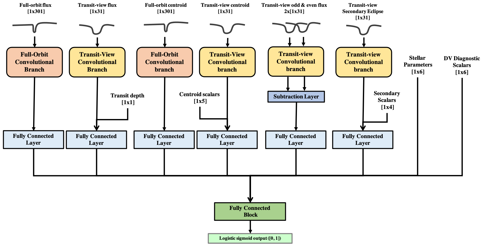

# ExoMiner

## Introduction

This project is intended to provide an automatic method to sift through photometry data from exoplanet detection
missions such as Kepler and TESS and inform subject matter experts (SMEs) on potential planet candidate transit signals
using Deep Learning methods.

### Current active goals

The current goals of the `ExoMiner` pipeline are:

1. Perform classification of transit signals into PC/non-PC and Object of Interest (OI)/non-OI;
2. Validate new exoplanets in Kepler and TESS data;
3. Create an explainability framework that provides SMEs a set of explanations that support the model`s outcome.
4. Study and detect mislabeling noise in Kepler and TESS data.
5. Create vetted catalogs of Threshold Crossing Events (TCEs) for TESS Cycles.
6. Create eclipsing binary (EB) catalogs for TESS data.

## Pipeline Overview

The pipeline consists of the following main blocks:

1. Data wrangling: perform operations on the data products that are used to generate the datasets to train and evaluate
   the models, and to run inference. This set of code involves tasks such as creating transit signal tables used to
   preprocess the data, perform analysis of the data, and evaluate results and rankings produced by the models. Code
   under `data_wrangling`.
2. Data preprocessing: preprocess data products (e.g. light curve FITS files)
   to generate a catalog of transit signal features to be used for training and evaluating models, and to run inference
   on it. Code under `src_preprocessing`.
3. Model training: train models on the preprocessed data.
    1. Hyper-parameter optimization: find a set of optimized hyper-parameters by running Bayesian optimization (vanilla
       or [BOHB](https://github.com/automl/HpBandSter)), or random search. Code under `src_hpo`.
4. Model evaluation: evaluate model performance against a holdout test set or by K-fold CV. Code under `src`
   and `src_cv`. Other additional experiments are shown below.
    1. Label noise injection: add artificial label noise to the training set and study the impact on model performance
       on a fixed test set. Code under `label_noise`.
    2. Adjusting size of training set: selectively sample the training set and study the impact on model performance on
       a fixed test set. Code under `size_training_set`.
    3. Transfer learning to different datasets: perform transfer learning experiments to apply models across different
       datasets (e.g. from Kepler to TESS). This includes analyzing impact of certain input features in the model
       performance, and fine-tuning certain layers.
    4. Explainability: design explainability studies that (1) help in improving and finding blindspots of the model,
       and (2) provide interpretation for the researcher/SME on the model output.
5. Inference: run trained models on a generated catalog of transit signals to generate a ranking that can be used for
   vetoing transit signals or exoplanet validation. Code under `src`.

## Data

All data used in this project are publicly available. Generally, the data used consist of:

- TCE and Objects of Interest (e.g. KOI and TOI catalogs) tables available at places such as
  [NExSci](https://exoplanetarchive.ipac.caltech.edu/),
  [ExoFOP](https://exofop.ipac.caltech.edu/), [TEV](https://tev.mit.edu/data/) and
  [MAST](https://archive.stsci.edu/);
- Light curve FITS files and other data products generated by the Science Processing Operations Center (SPOC) pipeline
  available at places such as
  [MAST](https://archive.stsci.edu/).

## Models

Models currently implemented:

1. `ExoMiner`: Multi-branch Convolutional Neural Network (CNN) whose design is inspired in the different diagnostic
   tests used in the Data Validation (DV) module of the SPOC pipeline.

2. Astronet: see https://github.com/google-research/exoplanet-ml and Shallue, Christopher J., and Andrew Vanderburg. "
   Identifying exoplanets with deep learning: A five-planet resonant chain around kepler-80 and an eighth planet around
   kepler-90." The Astronomical Journal 155.2 (2018): 94.
3. Exonet: see Ansdell, Megan, et al. "Scientific domain knowledge improves exoplanet transit classification with deep
   learning." The Astrophysical journal letters 869.1 (2018): L7.
4. Exonet-XS: see Ansdell, Megan, et al. "Scientific domain knowledge improves exoplanet transit classification with
   deep learning." The Astrophysical journal letters 869.1 (2018): L7. 5 MLP: Multi-layer Perceptron.

## References

For more detailed information check:
- ExoMiner 2021
  paper ["ExoMiner: A Highly Accurate and Explainable Deep Learning Classifier that Validates 301 New Exoplanets"](https://arxiv.org/abs/2111.10009)
  , published 2022 February 17 in
  the [Astrophysical Journal, 926:120](https://iopscience.iop/articl/10.3847/1538-4357/ac4399/).
- Bibliography
    - **add**

## Credits

- Active developers
    - Hamed Valizadegan1,2, hamed.valizadegan@nasa.gov
    - Miguel Martinho1,2, miguel.martinho@nasa.gov
    - Hongbo Wei2,6,7 (Kepler non-TCE classification, KOI classification, Kepler to TESS transfer learning)
    - Charles Yates 2,5 (Unfolded phase time series for transit signal classification)
    - Stuti Agrawal 6 (Difference image)
    - Joshua Belofsky 2,5 (Difference image)

- Past developers 
    - Andres Carranza 2,5 (Unfolded phase time series for transit signal classification)
    - Fellipe Marcellino2 (Transit detection using Kepler data)
    - Jennifer Andersson4 (Kepler to TESS transfer learning)
    - Kaylie Hausknecht2,6 (Explainability framework using Kepler data)
    - Laurent Wilkens2 (Kepler)
    - Martin Koeling4 (Kepler to TESS transfer learning)
    - Nikash Walia2 (Kepler)
    - Noa Lubin 4 (Kepler)
    - Pedro Gerum4 (Kepler, Kepler non-TCE classification)
    - Patrick Maynard2,5,7 (Kepler to TESS transfer learning)
    - Sam Donald4 (Kepler to TESS transfer learning)
    - Theng Yang2,7 (Label noise detection in Kepler data)

- Collaborators
    - Doug Caldwell1,3
    - Jeff Smith1,3
    - Jon Jenkins1,3
    - Joseph Twicken1,3
    - Stephen Bryson1

1 - NASA Ames Research Center (NASA ARC)\
2 - Universities Space Research Association (USRA)\
3 - The SETI Institute\
4 - NASA International Internship Program (NASA I2)\
5 - NASA Internships, Fellowships & Scholarships (NIFS)\
6 - Volunteer Internship Program (VIP)\
7 - NASA Office of STEM Engagement (OSTEM)

## Acknowledgements

We would like to acknowledge people that in some way supported our efforts:

- David Armstrong for insightful discussion that helped improving our work.
- Megan Ansdell for providing information on their code and work.
 
